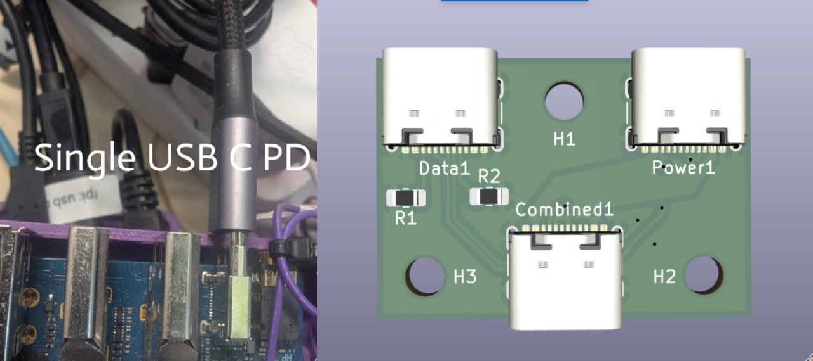

# PCB to multiplex Power and Data

The Rock 5B RK3588 multiplexes a single USB-C PD port for both power and USB data.
For frequent firmware flashing, connecting this port directly to a host is convenient because it
directly provides access to MaskROM mode to flash opencca firmware.

Many hosts cannot supply enough current for the board to operate reliably under high load.

This repository provides a custom PCB that de-multiplexes the USB-C PD connection back into
- USB 2.0 data line for flashing
- and a dedicated power input for external power supply.

